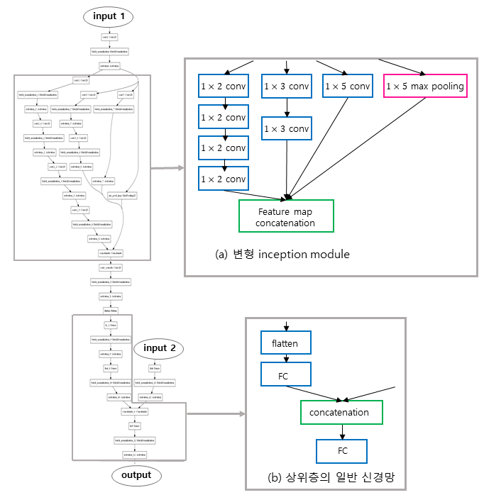
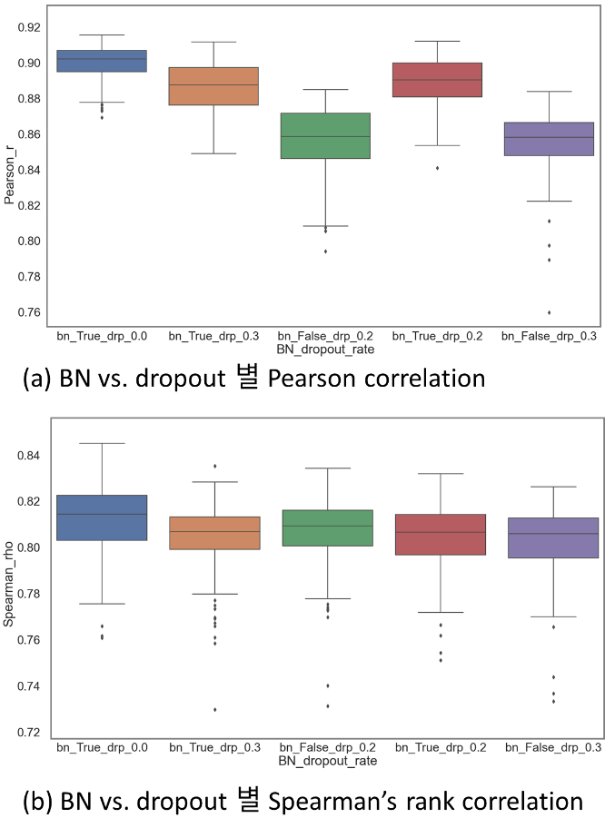

# PreCA-Net
PreCA-Net : Prediction for CRISPR-Cas9 variants’ Activities on Deep Neural Network

    
    
    Abstract

        PreCA-Net: Prediction
        for CRISPR-Cas9 variants’ Activities
        on Deep Neural Network
                    
            SE HYUK KWON
            School of Engineering and Technology
            Graduate School
            Korea University
            Supervised by Prof. CHANG-SUNG JEONG

         The CRISPR-Cas9 system has been utilized in various fields including the development of insect-resistant agricultural or livestock products 
        and disease treatment by correcting or removing genes that cause diseases. However, researchers must spend a lot of time and effort 
        to find the most efficient guide RNA and Cas9 variants for their own research projects.
        
         Here, we propose PreCA-Net, a deep-learning model that predicts the activity of Cas9 variants from any target sequence by using recently developed CNN models. 
        PreCA-Net uses convolutional layers to create general feature maps of Cas9 variants and multiple sizes of kernels with a modified inception module to learn various patterns of target sequences. 
        Through batch normalization, PreCA-Net prevents internal covariate shifts when learning and creates models faster by giving large learning rates. 
        Additionally, PreCA-Net makes specialized models for each Cas9 variant by fine tuning. The general mean squared error and the Pearson correlation
        , an indication of performance evaluation of models, were applied as customized loss function to simultaneously learn a positive linear relationship 
        between the predicted activity of Cas9 variants and its target value.
        
         PreCA-Net predicts the efficiency of guide RNAs for each Cas9 variant in all possible target sequences 
        so that researchers can choose the most appropriate Cas9 variants and guide RNAs for their own research needs. 

    
    
[PreCA-Net structure]

[one-hot encoding by DataGenerator.py]

    
        how to set env
        non_GPU
        if window
            conda create -n astroboi_tf_23 python=3.8 tensorflow=2.3.0 h5py=2.10.0
            conda activate astroboi_tf_23
        
        
            conda create -n astroboi_tf_2 python=3.6 tensorflow=2.1.0 h5py=2.10.0
            conda activate astroboi_tf_2
        
        elif Linux
            conda create -n astroboi_tf_22 python=3.6 tensorflow=2.2.0 h5py=2.10.0
            conda activate astroboi_tf_22
        
        with CUDA
        CUDA 10.1
        cudnn 7.6.5
        if window
            conda create -n astroboi_cuda_23 python=3.8 tensorflow-gpu=2.3.0 h5py=2.10.0
            conda activate astroboi_cuda_23
        
            conda create -n astroboi_cuda_22 python=3.6 h5py=2.10.0
            conda activate astroboi_cuda_22
            pip install tensorflow-gpu==2.2.0
        
        
        elif Linux
            conda create -n astroboi_cuda_24 python=3.8 tensorflow-gpu=2.4.1 h5py=2.10.0
            conda activate astroboi_cuda_24
        
            conda create -n astroboi_cuda_22 python=3.6 tensorflow-gpu=2.2.0 h5py=2.10.0
            conda activate astroboi_cuda_22
        
        
        conda install -c anaconda pandas=1.1.3 xlrd=1.2.0 pydot=1.4.1 pydotplus=2.0.2 scikit-learn=0.23.2
        conda install -c conda-forge matplotlib=3.3.3
